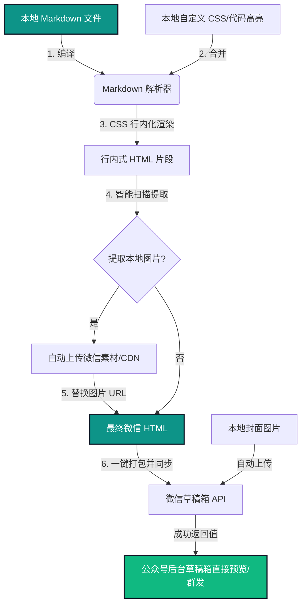

# 🚀 WeChat Markdown Sync Tool (微信公众号 Markdown 自动排版与草稿同步工具)

[](LICENSE)
[](https://www.python.org/)
[](#)

> **极客公众号作者的效率神器。** 彻底告别反人类的公众号后台编辑器，让你可以继续在最喜欢的 Markdown 编辑器（Typora, VSCode, Obsidian 等）中专注写作，剩下的排版与草稿同步工作，交由我们一键全自动搞定。

---

## 😫 传统运营者的痛点

你是否也曾在发布公众号文章时被这些恶心的问题折磨？

* **排版地狱**：直接粘 Markdown 格式到微信公众号后台会严重走样，被迫使用各种第三方网页排版器在浏览器标签页之间反复复制粘贴。
* **媒体同步繁琐**：Markdown 文档中的本地插图无法被微信编辑器识别，需要手动将图片一张张上传到微信媒体库，再挨个拖拽到正文中替换。
* **高亮代码格式化失效**：技术类公众号的代码块排版简直是灾难，微信官方甚至不提供好用的语法高亮，导致代码行被截断或背景丑陋。
* **令人窒息的 API 报错**：摘要稍长就触发 `45004` (Description size limit) 错误；在本地测试又经常因为外网 IP 未加白而抛出 `40164` (IP not in whitelist) 报错；Access Token 管理混乱导致额度早早耗光。

**WeChat Markdown Sync Tool 就是为此而生的自动化解放双手方案。**

---

## 🔄 核心同步流向图



---

## 📊 核心方案对比

| 功能特性 | 传统手动公众号排版 | 浏览器 Markdown 同步插件 | WeChat Sync Tool (本项目) |
| :--- | :---: | :---: | :---: |
| **写作环境** | 公众号后台网页 (极差) | 任意本地 Markdown 编辑器 | **任意本地 Markdown 编辑器** |
| **排版效率** | 手动逐段格式化 (极慢) | 手动复制 + 插件转换 (一般) | **CLI/网页一键完成 (秒级)** |
| **本地图片处理** | 需单独导出并手动逐张上传 | 仅支持公网图片或手动粘贴上传 | **自动扫描并替换为微信 CDN 地址** |
| **代码高亮定制** | 不支持，代码显示杂乱 | 受限于插件自带样式 | **Pygments 语法渲染，百款高亮注入** |
| **多媒体安全拦截** | 无自动保护，易超标报错 | 无法拦截处理 | **自动字节截断防微信 45004 报错** |
| **运行平台** | 浏览器 | 仅限特定安装了插件的浏览器 | **跨平台，支持 CLI & 现代 Web UI** |

---

## 🌟 核心特性

* 📱 **双模运行体验**：
  * **CLI 命令行模式**：专为自动化极客和集成工作流（如 Git Hooks, CI/CD, 自动脚本）设计，一行命令瞬间同步。
  * **Web UI 操作台**：内置现代深黛青 (Elegant Teal) 暗黑风格控制台。提供文件与封面图智能扫描选择、无刷新配置面板及动态运行日志。
* 🎨 **100% 样式还原 (CSS 行内化)**：基于 `premailer` 与 `beautifulsoup4`，将你的 CSS 样式与代码高亮规则深层解析并 100% 注入到 HTML 每个标签的 `style` 属性中，轻松击碎微信对 `<style>` 标签的过滤。
* 💻 **服务端代码块高亮**：搭载 **Pygments** 高亮引擎，支持 `monokai`, `github`, `dracula` 等上百种经典配色，高亮样式同样直接转为 Inline Style。
* 🖼️ **多媒体一键托管**：自动提取 Markdown 内引用的本地相对路径图片，一键批量上传至微信 CDN 自动替换为线上 URL，同时自动上传封面获取 `thumb_media_id`。
* 🛡️ **健壮的防御性开发**：
  * **摘要字节截断**：未提供摘要时自动解析正文，针对微信严格的 **120字节** 限制进行安全的按字节截断，彻底阻断微信 `45004` 错误。
  * **IP 拦截辅助定位**：捕获经典的 `40164` (IP 未加白名单) 报错，提取您当前的公网请求 IP，并给出公众号后台配置的直接引导说明。
  * **智能缓存**：维护 `.wechat_token.json` 缓存，自动管理 Token 过期与刷新，避免触发微信 API 访问频率上限。

---

## 🛠️ 快速开始

### 1. 环境准备
项目推荐使用 Python 3.8 及以上版本。在项目根目录下安装所有运行依赖：
```bash
pip install -r requirements.txt
```

### 2. 配置微信公众平台凭证
你可以通过两种方式进行配置：
* **方式一 (推荐)**：在启动 Web UI 后直接在侧边栏配置面板中无刷新填写并保存。
* **方式二**：复制模板文件 `config.yaml.example` 为 `config.yaml`，用编辑器打开并填入你的 AppID 和 AppSecret：
  ```yaml
  wechat:
    appid: "你的微信公众号AppID"
    secret: "你的微信公众号AppSecret"
  ```
> 💡 **微信 IP 白名单说明**：若首次同步时控制台提示 `40164 (IP未加白)`，请登录「微信公众平台 -> 开发 -> 基本配置 -> IP白名单」，将控制台日志中打印出的您当前的公网 IP 加入微信的白名单配置中。

### 3. 运行程序

#### 💻 【方式 A】拉起高质感 Web UI 操作台（推荐）
直接在项目根目录下运行：
```bash
python main.py --ui
```
控制台会自动启动本地 Web 服务，并在 1 秒后**自动用你的默认浏览器打开** `http://127.0.0.1:5000` 进入工作台，享受丝滑的一键操作。

#### 🐚 【方式 B】终端命令行直接同步
如果你倾向于在 Shell 中操作，可以直接使用 CLI 模式：
```bash
python main.py --md test.md --cover cover.png
```

---

## ⚙️ 命令行进阶参数表

| 选项 (长/短) | 说明 | 默认值 |
| :--- | :--- | :--- |
| `--ui` | **启动图形化 Web UI 界面模式**（此模式下无需传 md 与 cover 参数） | - |
| `-m, --md` | 本地 Markdown 文件路径 (命令行模式下必填) | - |
| `-c, --cover` | 封面图片路径 (本地图片，命令行模式下必填) | - |
| `-t, --title` | 图文标题（未指定则自动提取 Markdown 首个 `# H1`，或使用文件名） | - |
| `-a, --author` | 作者（未指定则默认读取 `config.yaml` 默认作者） | - |
| `-d, --digest` | 文章摘要（未指定则自动按 120 字节限额安全截断正文） | - |
| `--config` | 配置文件路径 | `config.yaml` |
| `--style` | 自定义排版样式表路径 | `styles/default.css` |
| `--pygments-style` | 代码块语法高亮主题 (可选 `monokai`, `github`, `dracula` 等) | `monokai` |
| `--content-source-url` | 原文链接（即“阅读原文”超链接） | 无 |

---

## 🧪 本地排版效果预览

在正式发布至微信前，你可以运行测试脚本确认本地 HTML 转换效果（无需调用微信接口）：
```bash
python test_render.py
```
这将在本地生成一个 [output_test.html](file:///e:/auto-gzh/output_test.html)。右键使用浏览器打开即可查验样式行内化（Inline CSS）及代码高亮是否正确生成。

---

## 🤝 参与贡献

我们欢迎并鼓励任何形式的贡献！无论是提交 Bug 反馈、功能申请，还是直接提交 Pull Request。

1. Fork 本项目到你的账户。
2. 新建你的特性分支 (`git checkout -b feature/AmazingFeature`)。
3. 提交你的修改并保持良好的 commit 信息 (`git commit -m 'Add some AmazingFeature'`) \。
4. 推送分支到 GitHub 仓库 (`git push origin feature/AmazingFeature`)。
5. 提交一个 Pull Request。

> ⚠️ 请在发起反馈和提交 PR 前查看我们的 [GitHub Issue & PR 规范模板](.github/)。

---

## 📝 许可证

本项目采用 [MIT License](LICENSE) 授权许可。
